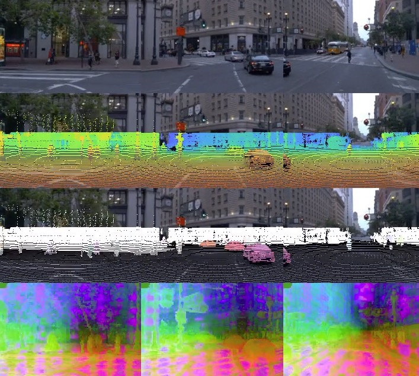

# EmerNeRF

PyTorch implementation of:
> [**EmerNeRF: Emergent Spatial-Temporal Scene Decomposition via Self-Supervision**](https://arxiv.org/abs/2311.02077),  
> [Jiawei Yang](https://jiawei-yang.github.io), [Boris Ivanovic](https://www.borisivanovic.com/), [Or Litany](https://orlitany.github.io/), [Xinshuo Weng](https://www.xinshuoweng.com/), [Seung Wook Kim](https://seung-kim.github.io/seungkim/), [Boyi Li](https://sites.google.com/site/boyilics/home), [Tong Che](), [Danfei Xu](https://faculty.cc.gatech.edu/~danfei/), [Sanja Fidler](https://www.cs.utoronto.ca/~fidler/), [Marco Pavone](https://web.stanford.edu/~pavone/), [Yue Wang](https://yuewang.xyz/)

#### [Project page](https://emernerf.github.io) | [Paper](https://arxiv.org/abs/2311.02077)

<p align="center">
  
</p>

## News

- [2023/11/05] We've released an initial version of EmerNeRF, which supports the NeRF On-The-Road (NOTR) dataset sourced from the Waymo Open Dataset. NuScenes support is also available.

## Table of Contents

- [Introduction](#introduction)
- [Installation](#installation)
- [Dataset preparation](#dataset-preparation)
- [Run the code](#run-the-code)
  - [Configs](#configs)
  - [Training](#training)
  - [Voxel Inspection](#voxel-inspection)
- [Pretrained models](#pretrained-models)
- [Citation](#citation)
- [FAQ](docs/FAQ.md)

## Introduction

We introduce EmerNeRF, a self-supervised approach that utilizes neural fields for spatial-temporal decomposition, motion estimation, and the lifting of foundation features. EmerNeRF can decompose a scene into dynamic objects and a static background and estimate their motion in a self-supervised way. Enriched with lifted and "denoised" 2D features in 4D space-time, EmerNeRF unveils new potentials for scene understanding. Additionally, we release the NeRF On-The-Road (NOTR) dataset split to support future research.

## Installation

Our code is developed on Ubuntu 22.04 using Python 3.9 and PyTorch 2.0. Please note that the code has only been tested with these specified versions. We recommend using conda for the installation of dependencies. The installation process might take more than 30 minutes.

1. Create the `emernerf` conda environment and install all dependencies:

```shell
conda create -n emernerf python=3.9 -y
conda activate emernerf
# this will take a while: more than 10 minutes
pip install -r requirements.txt
```

2. Install `nerfacc` and `tiny-cuda-nn` manually:

```shell
pip install git+https://github.com/KAIR-BAIR/nerfacc.git
pip install git+https://github.com/NVlabs/tiny-cuda-nn/#subdirectory=bindings/torch
```

**Troubleshooting**:

<details>
  <summary><strong>nvcc fatal : Unsupported gpu architecture 'compute_89` </strong></summary>

If you encounter the error `nvcc fatal : Unsupported gpu architecture 'compute_89`, try the following command:

```
TCNN_CUDA_ARCHITECTURES=86 pip install git+https://github.com/NVlabs/tiny-cuda-nn/#subdirectory=bindings/torch
```

</details>

<details>
  <summary><strong>error: parameter packs not expanded with ‘...’</strong></summary>

If you encounter this error:

 ```
 error: parameter packs not expanded with ‘...’
 ```

Refer to [this solution](<https://github.com/NVlabs/instant-ngp/issues/119#issuecomment-1034701258>) on GitHub.

</details>

## Dataset preparation

- **NOTR (Waymo) Dataset**: See [NOTR Dataset Preparation](docs/NOTR.md) for detailed instructions on preparing the NOTR dataset.
  
- **NuScenes Dataset**: For preparing the NuScenes dataset and viewing example sample results, refer to [NuScenes Dataset Preparation](docs/NUSCENES.md).
  
For those interested in setting up a custom dataset, kindly use these two datasets as templates. Also take a look at the `datasets/base directory` to familiarize yourself with the dataset preparation process in our codebase.

## Run the code

### Configs

We have provided detailed comments in `configs/default_config.yaml` for each configuration. Alongside the released code, you'll also find these detailed comments.

### Training

Sample training scripts can be found in `sample_scripts/`

1. **Data inspection**. Before initiating the training, you might want to inspect the data. We've included a script for visualizing the data. To visualize the NOTR dataset, execute the following:

```shell
# Adjust hyper-parameters as needed
python train_emernerf.py \
    --config_file configs/default_config.yaml \
    --output_root $output_root \
    --project $project \
    --run_name ${scene_idx} \
    --render_data_video_only \  # This will render a video of the data.
    data.scene_idx=$scene_idx \
    data.pixel_source.load_size=[160,240] \ # Downsample to enhance the visibility of LiDAR points.
    data.pixel_source.num_cams=3 \ # Opt for 1, 3, or 5
    data.start_timestep=0 \
    data.end_timestep=-1 

```

This script produces a video similar to the one below, showcasing LiDAR points colored by their range values and the 3D scene flows, and their feature maps (if `load_features=True`):

<p align="center">
  
</p>

<p align="center">
  
</p>

2. **Training**. For the most comprehensive EmerNeRF training (incorporating dynamic encoder, flow encoder, and feature lifting), use:

```shell
  python train_emernerf.py \
    --config_file configs/default_flow.yaml \
    --output_root $output_root \
    --project $project \
    --run_name ${scene_idx}_flow \
    data.scene_idx=$scene_idx \
    data.start_timestep=$start_timestep \
    data.end_timestep=$end_timestep \
    data.pixel_source.load_features=True \
    data.pixel_source.feature_model_type=dinov2_vitb14 \
    nerf.model.head.enable_feature_head=True \
    nerf.model.head.enable_learnable_pe=True \
    logging.saveckpt_freq=$num_iters \
    optim.num_iters=$num_iters
```

For more examples, refer to the `sample_scripts/` folder.

3. **Voxel Inspection**. We've provided visualization code to display spatial-temporal features as shown on our homepage. To visualize voxel features, simply add `--visualize_voxel` and specify `resume_from=$YOUR_PRETRAINED_MODEL`. This will produce an HTML file which you can open in a browser for voxel feature visualization:

<p align="center">
  
</p>

## Pretrained models

- [ ] We will release all pretrained models soon. Do note that the distribution of pretrained models will be in accordance with Waymo's data sharing policy. Hence, we will only release pretrained models for registered users upon request. More details will be provided soon.

## Citation

Consider citing our paper if you find this code or our paper is useful for your research:

```bibtex
@article{yang2023emernerf,
    title={EmerNeRF: Emergent Spatial-Temporal Scene Decomposition via Self-Supervision},
    author={Jiawei Yang and Boris Ivanovic and Or Litany and Xinshuo Weng and Seung Wook Kim and Boyi Li and Tong Che and Danfei Xu and Sanja Fidler and Marco Pavone and Yue Wang},
    journal={arXiv preprint arXiv:2311.02077},
    year={2023}
}
```
