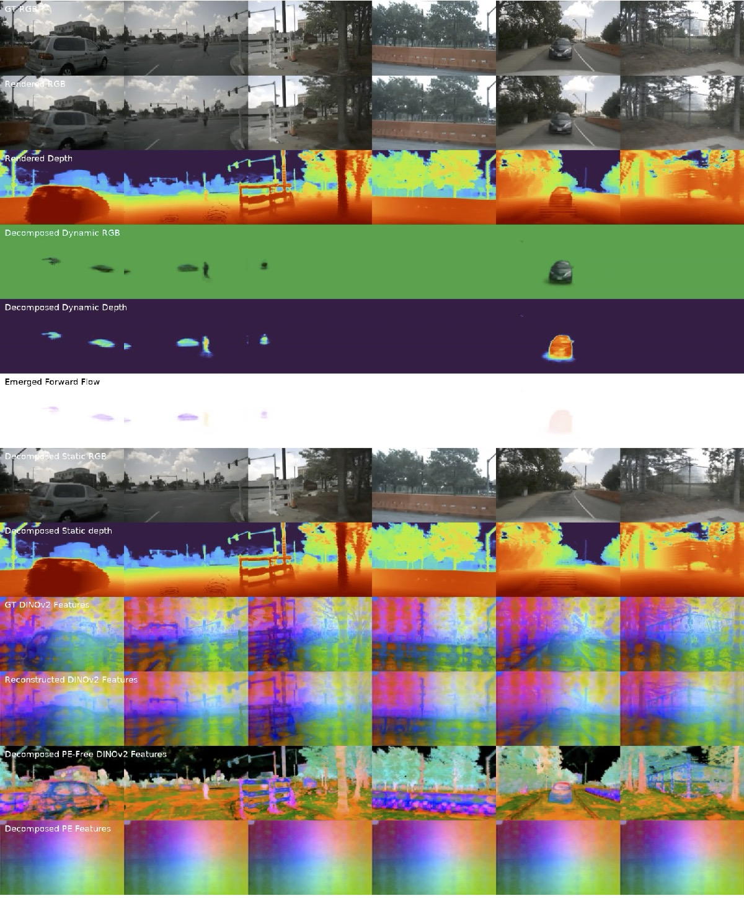
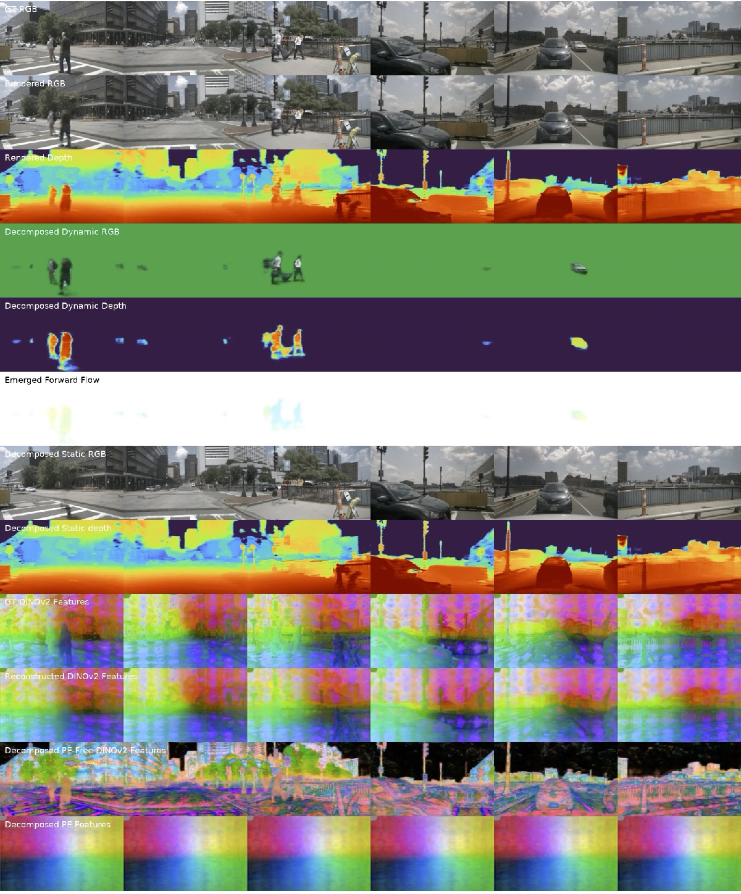

## Preparing NuScenes Dataset

The NuScenes dataset is a popular autonomous driving dataset. Follow the steps below to set it up and prepare it for use:

### Download the dataset

1. Setup Directories:

Create directories for NuScenes data and optionally create a symbolic link if you have the data elsewhere.

```shell
mkdir -p data/nuscenes
ln -s $PATH_TO_NUSCENES data/nuscenes
```

2. Download NuScenes Data:

The dataset can be downloaded from the NuScenes official website. Once downloaded, unzip and place it in the `data/nuscenes` directory.

3. Download Sky Masks:

Sky masks help in addressing the ill-defined depth for sky. Download the sky masks from the provided [Google Drive link](https://drive.google.com/file/d/1vs8ZIYRaJOI1tkjgJFxr065OTvz0Rk0T/view) and unzip them in the `data/nuscenes/` directory.

Once done, you're all set to integrate and use the NuScenes dataset in your project!

### Known TODOs

- [ ] **Extract dynamic object masks from NuScenes dataset**: Should be straightforward to do, but we haven't done it yet.
- [ ] **Add GT flows for evaluation**
- [ ] **Support novel view synthesis**: Currently, we have not implemented train/test splits for novel view synthesis, because it requires splitting asynchronous  LiDAR and camera data.

Any contribution is welcome!

## Running the code

Example scripts to run experiments on NuScenes can be:

```shell
python train_emernerf.py \
    --config_file configs/default_dynamic.yaml \
    --output_root $output_root \
    --project $project \
    --run_name $scene_idx \
    --render_data_video \
    data.data_root="data/nuscenes" \  # set the data root
    data.dataset="nuscenes" \         # set the dataset
    data.scene_idx=$scene_idx \
    data.pixel_source.num_cams=6 \    # set the number of cameras, 1, 3, or 6
    data.pixel_source.load_size=[450,800] \  # set the image size
    data.pixel_source.skip_feature_extraction=False \ # set to True if you want to skip feature extraction
    data.pixel_source.load_features=True \ # set to True if you want to load features
    data.pixel_source.feature_model_type=dinov2_vitb14 \ # set the feature model type
    data.lidar_source.truncated_min_range=-60 \ # IMPORTANT because our default setting is -2.
    data.start_timestep=0 \
    data.end_timestep=100 \
    nerf.model.head.enable_feature_head=True \
    logging.saveckpt_freq=$num_iters \
    optim.num_iters=$num_iters
```

Below are some *baseline* results from EmerNeRF. Please note that these are *preliminary* and represent a minimally trained and tuned version of EmerNeRF:




